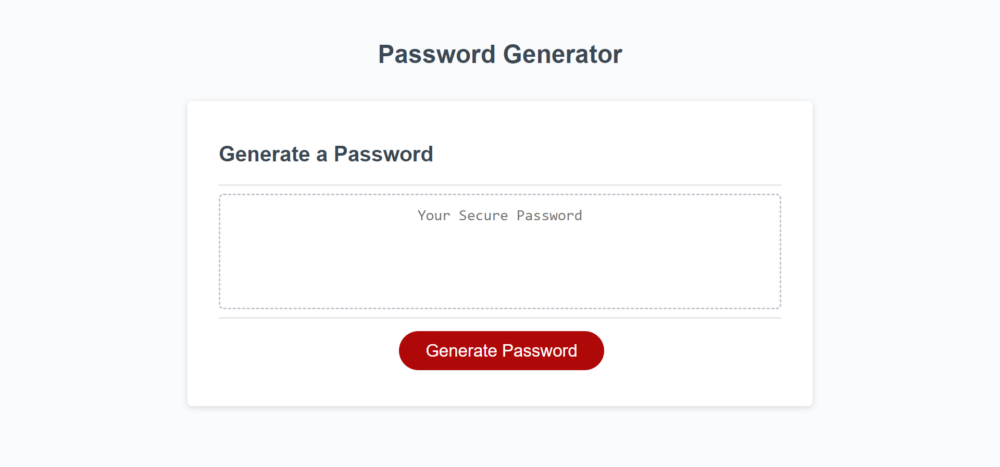

# Password Generator

## Project status
This project is complete.

## Description
A challenge for myself to build a basic password generator, relying both on the Javascript methods and knowledge acquired so far, and on researching new concepts. The aim was to see if my understanding of JavaScript tools and functions were sufficient to build a basic prompts-to-calculations-to-print web-app. The activity was a useful test of my skills and there were elements of it I had never faced before. The page showcases random-selector tools, prompts and confirms, variable storing from functions and a brief introduction to printing to the HTML. It is a simple but functional app for generating passwords from a random selection of letters, numbers and special characters. I made use of multiple arrays to ensure each character type selected was guaranteed to appear at least once. I also included a shuffle function to make the passwords generated appear more aesthetically 'random'.

https://rowankinross.github.io/password-generator/

## Visuals
The following demo shows the appearance of the application and the process of generating a password:

## Installation
n/a

## Usage
The title shows the name and function of the app. The display box contains a blank text box and a button to click for generating your password. Upon clicking the buitton you are met with a prompt asking the length of password you would like, some confirms regarding the characters types you would like included and an alert to say the password is generating. If a number is written which is not between the stated range, you are alerted to try inputting again. Finally the randomly-generated password is printed to the display box.

## Contributing
As this is a personal project, designed to challenge and test my skills, I am not currently looking for contributors.

## Credits

edX challenge materials for setting the challenge and providing me with the skills to take on this project.

## License

MIT License - refer to LICENSE in the repo.